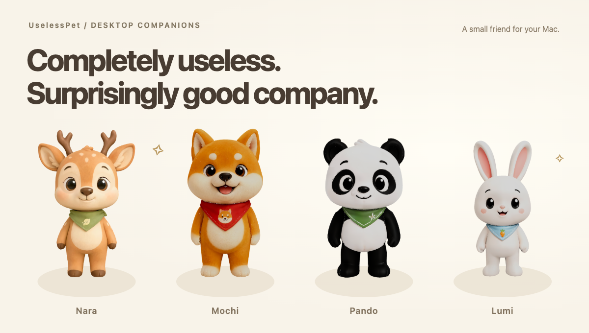
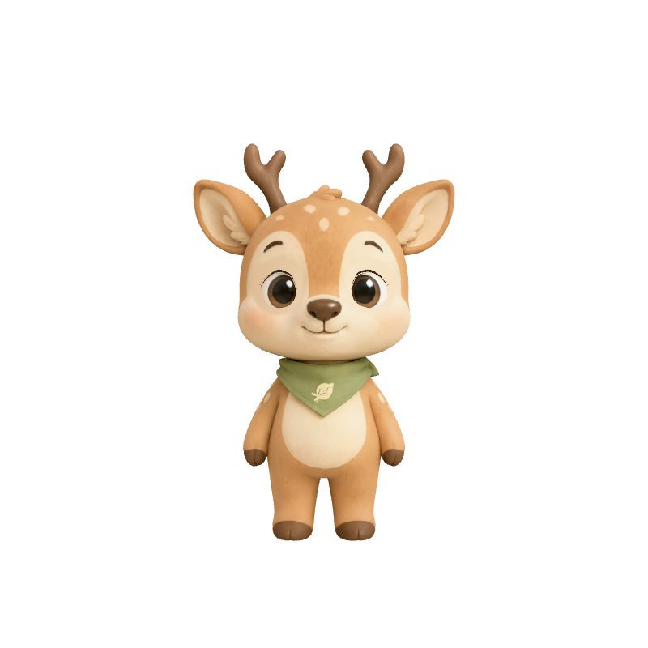
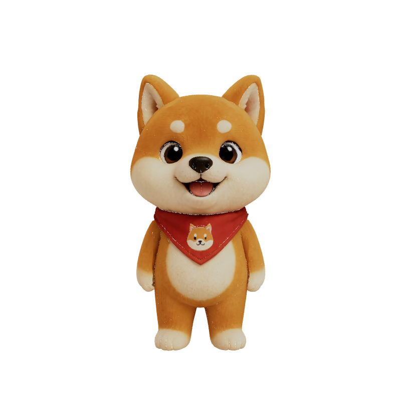
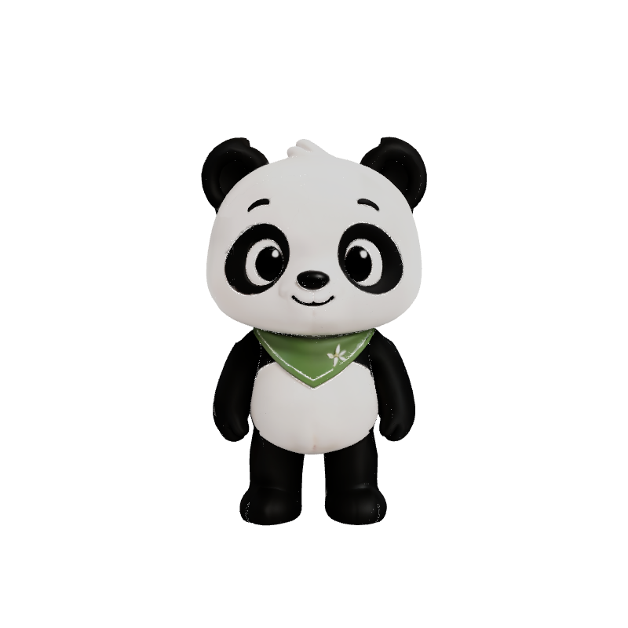
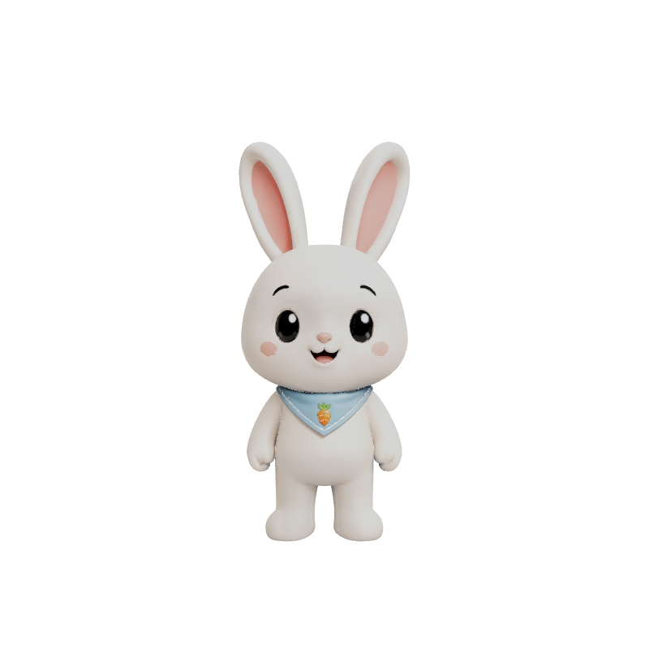
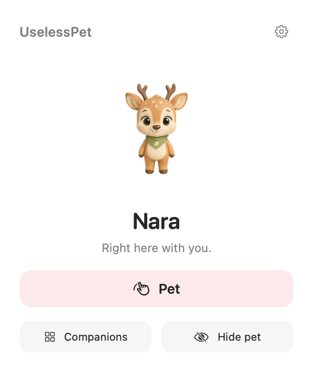
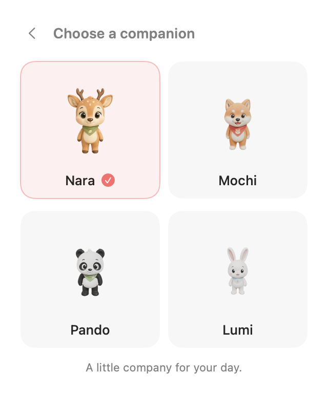

<p align="center">
  
</p>

<h1 align="center">UselessPet</h1>
<p align="center"><strong>Completely useless. Surprisingly good company.</strong></p>
<p align="center">A quiet, animated 3D companion for your Mac.</p>
<p align="center">
  <a href="https://github.com/larrylabs/UselessPet/actions/workflows/ci.yml"></a>
  
  <a href="LICENSE"></a>
  <a href="ASSET_LICENSE.md"></a>
</p>

UselessPet sits on your desktop, looks around, and occasionally deserves a pat.
It has no productivity advice. It is very happy about this arrangement.

Choose a friend, find them a comfortable corner, and get on with your day.

## Meet your company

| Nara | Mochi | Pando | Lumi |
| :---: | :---: | :---: | :---: |
|  |  |  |  |
| Quietly curious. | Pleased to see you. | Taking it easy. | A little daydreamer. |

- **Four animated friends.** Real 3D characters, gentle idle movement, blinking, and optional cursor following.
- **A small moment of joy.** Give your pet a pat for one of five playful reactions.
- **A home on your desktop.** Drag, resize, hide, show, or bring your friend to your current screen.
- **A tiny menu bar panel.** Choose your companion and adjust a few simple preferences, in light or dark mode.
- **Five languages.** English, Simplified Chinese, Traditional Chinese, Japanese, and Spanish.
- **Local company.** No account, telemetry, cloud model, microphone, camera, or screen recording. [Privacy details →](PRIVACY.md)

## A peek inside

<p align="center">
  <picture>
    <source media="(prefers-color-scheme: dark)" srcset="docs/media/home-dark.png">
    
  </picture>
  &nbsp;&nbsp;
  <picture>
    <source media="(prefers-color-scheme: dark)" srcset="docs/media/picker-dark.png">
    
  </picture>
</p>

These are native app screenshots and renders of the included characters.

## Run from source

This first release builds from source. For an app you can open from Finder or Spotlight, run `make install-dev` after setup; it installs **UselessPet Dev** in Applications. There is no public DMG.

**You need:** macOS 15 or later, full **Xcode 16 or later** (open it once to finish setup), and **[uv](https://docs.astral.sh/uv/getting-started/installation/)**. The Apple Silicon build is tested; Intel Macs are not yet verified. The repository includes about 721 MiB of character assets.

If you use Homebrew, install uv with `brew install uv`. Then:

```sh
git clone https://github.com/larrylabs/UselessPet.git
cd UselessPet
export DEVELOPER_DIR=/Applications/Xcode.app/Contents/Developer
make setup
make run
```

For later development updates, run `make install-dev` again after validating your changes. The installed Dev app shows its build time in Settings and uses separate local state. See [the Dev app workflow](docs/DEVELOPMENT.md#installed-local-dev-app).

`make setup` installs the locked Python environment. uv can download a compatible Python if needed. The first native build takes longer; later launches reuse it. If Xcode is installed elsewhere, adjust `DEVELOPER_DIR` to match.

A little paw appears in your menu bar, and your companion appears on the desktop.

1. Click the **paw** to open the home panel.
2. Choose **Companions** to meet the other three.
3. Click **Pet**, or right-click the desktop pet and choose **Pet**.
4. Open **Settings** to change size, cursor following, or language.
5. Choose **Quit UselessPet** from the menu, or press **Control-C** in the launch terminal.

Keep that terminal session open while UselessPet runs. The launcher stops its own background service when you quit. It leaves an independently started service running.

**Update:** quit UselessPet, then run `git pull --ff-only`, `make setup`, and `make run` from the repository.

<details>
<summary><strong>Something feels off?</strong></summary>

- **“RealityKit” or SDK build errors:** check that full Xcode is installed and the `DEVELOPER_DIR` above points to it. Command Line Tools alone are insufficient.
- **Pet is on another screen:** use the paw panel's eye button to bring it to the active screen.
- **Reconnecting:** restart `make run`. Another local process may be using port `17574`; see [development settings](docs/DEVELOPMENT.md).
- **Saved state cannot be read:** the original file is preserved. Quit first and back up `~/Library/Application Support/UselessPet/` before editing or moving it.
- **Still stuck:** [open an issue](https://github.com/larrylabs/UselessPet/issues/new/choose) with your macOS/Xcode versions and the relevant error, leaving out private paths and tokens.

</details>

## Make it your own

Python owns the companion state and reactions. SwiftUI and RealityKit draw the pet and its little home. They talk over an authenticated connection on your own computer.

See the [development guide](docs/DEVELOPMENT.md), [contributing guide](CONTRIBUTING.md), and [asset notes](docs/ASSETS.md). Small fixes, language improvements, and thoughtful interaction ideas are welcome.

## Code and art

**Code and documentation are [MIT licensed](LICENSE). Character artwork has a [separate asset license](ASSET_LICENSE.md).** You can use the included pets for free, modify them privately, and share noncommercial UselessPet forks with credit. Commercial redistribution of the artwork requires permission. Screenshots and reviews, including monetized editorial content, are welcome under the asset license.

Created by [larrylabs](https://github.com/larrylabs). If one of these little friends makes your desktop a nicer place, a star helps other people find them.
